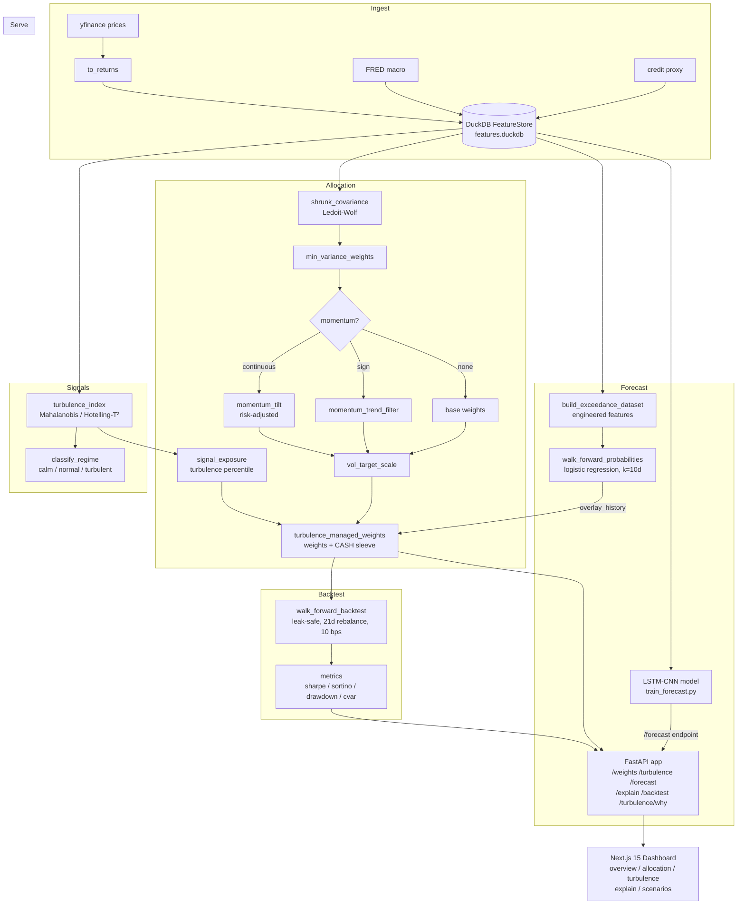
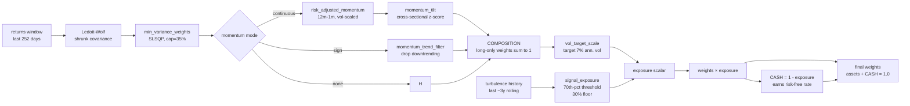

# turballoc — Financial Turbulence Detection and Dynamic Asset Allocation

**A risk-managed, alpha-tilted multi-asset allocation system that detects correlation breakdown in real time and dynamically scales portfolio exposure.**

Diversification fails precisely when it is most needed: asset correlations spike during crises, so a portfolio that looks diversified in calm markets collapses into a single risk-on/off factor during a drawdown. This system uses the Kritzman-Li (2010) turbulence index to detect that breakdown statistically and responds by scaling the book toward cash — combining a Ledoit-Wolf minimum-variance base, volatility targeting, a logistic exceedance forecaster, and a time-series momentum tilt into a single validated strategy. A naively turbulence-tilted Black-Litterman strategy dominated by equal-weight (Sharpe 0.27) was rebuilt into a rigorously backtested strategy with Sharpe 0.82, Sortino 1.05, and a maximum drawdown of -8.8% on an expanded 14-asset universe, all leak-safe, net of 10 bps, walk-forward 2010–2026.

---

## Key Results

Best configuration: expanded 14-asset universe, min-variance base, vol-targeting, turbulence overlay, continuous momentum tilt. Leak-safe walk-forward, 21-day rebalance, net of 10 bps.

| Configuration | Sharpe | Sortino | Ann. Return | Ann. Vol | Max Drawdown | Turnover |
|---|---|---|---|---|---|---|
| Equal-weight | 0.563 | 0.692 | 4.9% | 9.2% | -21.8% | 0.032 |
| Min-var + vol-target (no turbulence) | 0.644 | 0.767 | 3.2% | 5.1% | -17.0% | 0.425 |
| + Turbulence overlay | 0.696 | 0.904 | 2.9% | 4.2% | -16.0% | 1.818 |
| + Turbulence overlay (expanded 14-asset) | 0.714 | 0.912 | 1.8% | 2.5% | -10.3% | 1.829 |
| **+ Momentum continuous (expanded 14-asset)** | **0.822** | **1.048** | **1.9%** | **2.4%** | **-8.8%** | **2.016** |

Marginal Sharpe from the turbulence signal vs naive vol-targeting (core universe): **+0.052**.

---

## Architecture

### Full pipeline



### Single rebalance decision



---

## How It Works

### Two-layer design

Every rebalance separates two jobs:

**Composition** determines the relative mix of risky assets: a Ledoit-Wolf-shrunk global minimum-variance portfolio (SLSQP, per-asset cap 35%) optionally tilted by a time-series momentum signal. This layer ignores expected returns entirely — the noisiest, hardest-to-estimate input — and builds weights purely from the covariance.

**Exposure** scales the entire risky book toward a cash sleeve earning the risk-free rate. Two scalars are multiplied together: a volatility-targeting scalar (`min(1, target_vol / realized_vol)`, default 7% annualized) and a turbulence-driven scalar that ramps linearly from 1.0 down to a floor of 0.30 once the rolling turbulence percentile exceeds 70%. The resulting `CASH` weight earns an explicit risk-free return in the backtest.

### Turbulence index

For a return vector $x_t$ with rolling mean $\mu$ and inverse covariance $\Sigma^{-1}$ (estimated on a strictly causal trailing window, default 252 days, minimum 126), the turbulence index is the squared Mahalanobis distance:

```
d²_t = (x_t - μ)ᵀ Σ⁻¹ (x_t - μ)
```

Equivalently a one-sample Hotelling T² statistic. A high value means today's cross-asset return vector is statistically improbable under the recent covariance regime — not just that any single asset moved, but that the joint pattern across all assets is unusual. Regime labels (calm / normal / turbulent) are assigned by rolling quantiles.

### Exceedance forecaster (logistic regression)

Forecasting the turbulence *level* is a dead end: its autocorrelation decays from 0.48 at 1-day lag to near zero at 90 days, so any level regressor reduces to predicting the running mean. The LSTM-CNN (kept in `forecast/model.py`) was shown to be statistically indistinguishable from persistence on out-of-sample rank-IC and was discarded as the strategy signal.

The actionable target is *exceedance*: will turbulence cross its trailing 90th-percentile threshold within the next `k` trading days? A regularized logistic regression trained on 14 causal engineered features (log turbulence, turbulence momentum, realized volatility, cross-sectional dispersion, credit stress) beats the persistence baseline at every horizon:

| Horizon | Persistence AUC | Logistic regression AUC |
|---|---|---|
| k = 5 days | 0.701 | 0.759 |
| k = 10 days (default) | 0.685 | 0.727 |
| k = 21 days | 0.668 | 0.693 |

Gradient boosting over-fits (AUC 0.50–0.60 out-of-sample) and was also discarded. The logistic probability is the `overlay_history` signal fed into `turbulence_managed_weights` during the forecast-driven backtest.

### Leak-safe walk-forward

The backtest enforces strict no-lookahead: `walk_forward_backtest` passes only `returns.iloc[:i]` to the weight function at each rebalance step `i`. The exceedance walk-forward additionally excludes the final `k` rows from training at each fold (their labels have not yet resolved). Both constraints are unit-tested (`test_no_lookahead` in `tests/test_backtest.py`, `test_walk_forward_probabilities_are_leak_safe_and_in_unit_interval` in `tests/test_exceedance.py`).

---

## Results

### Strategy ladder (core 10-asset universe, 2010–2026)

| Config | Sharpe | Sortino | Ann. Return | Ann. Vol | Max Drawdown | Turnover |
|---|---|---|---|---|---|---|
| Equal-weight | 0.563 | 0.692 | 0.049 | 0.092 | -0.218 | 0.032 |
| Vol-target (no turbulence) | 0.644 | 0.767 | 0.032 | 0.051 | -0.170 | 0.425 |
| Turbulence-managed | 0.696 | 0.904 | 0.029 | 0.042 | -0.160 | 1.818 |

**Marginal Sharpe from the turbulence signal vs naive vol-targeting: +0.052.**

### Forecast-driven overlay (2013–2026, k=10d)

| Config | Sharpe | Sortino | Ann. Return | Ann. Vol | Max Drawdown | Turnover |
|---|---|---|---|---|---|---|
| Vol-target | 0.595 | 0.708 | 0.030 | 0.053 | -0.170 | 0.425 |
| Contemporaneous turbulence | 0.630 | 0.821 | 0.027 | 0.044 | -0.160 | 1.818 |
| Forecast-driven overlay | 0.694 | 0.921 | 0.029 | 0.043 | -0.150 | 1.278 |

The forecast overlay improves Sortino from 0.82 to 0.92 at *lower* turnover (1.28 vs 1.82) — the gain is better timing, not more trading.

### Momentum tilt (core 10-asset universe)

| Config | Sharpe | Sortino | Max Drawdown | Turnover |
|---|---|---|---|---|
| Base (no momentum) | 0.696 | 0.904 | -0.160 | 1.818 |
| + Continuous momentum | 0.706 | 0.915 | -0.148 | 2.038 |
| + Sign filter | 0.740 | 0.943 | -0.102 | 2.623 |

Sub-period Sharpe (robustness):

| Config | 2010–15 | 2016–20 | 2021–26 |
|---|---|---|---|
| Base (no momentum) | 0.59 | 1.44 | 0.34 |
| + Continuous momentum | 0.74 | 1.33 | 0.34 |
| + Sign filter | 0.95 | 0.92 | 0.48 |

### Expanded 14-asset universe (core + BIL / TIP / USO / EMB)

Eigenanalysis shows the first principal component explains 43.9% of core universe variance; effective breadth (entropy of normalized eigenvalues) is 4.89 out of 10, collapsing to 3.80 during the COVID crash. Adding the four distinct sleeves raises effective breadth to 6.54.

| Config | Sharpe | Sortino | Ann. Return | Ann. Vol | Max Drawdown | Turnover |
|---|---|---|---|---|---|---|
| Base (no momentum) | 0.714 | 0.912 | 0.018 | 0.025 | -0.103 | 1.829 |
| + Continuous momentum | **0.822** | **1.048** | **0.019** | **0.024** | **-0.088** | 2.016 |
| + Sign filter | 0.826 | 0.976 | 0.024 | 0.029 | -0.098 | 2.865 |

Sub-period Sharpe (robustness):

| Config | 2010–15 | 2016–20 | 2021–26 |
|---|---|---|---|
| Base (no momentum) | 0.44 | 1.56 | 0.41 |
| + Continuous momentum | 0.56 | 1.55 | 0.57 |
| + Sign filter | 0.85 | 1.10 | 0.62 |

### Crisis stress tests (expanded 14-asset, best config)

Total return through crisis windows:

| Window | SPY (buy & hold) | Equal-weight | Strategy (base) | Strategy (+momentum) |
|---|---|---|---|---|
| GFC aftershock / Euro crisis (2011) | -15.7% | -6.4% | -0.4% | -0.5% |
| 2015–16 China / oil rout | -13.1% | -10.2% | -1.5% | -1.4% |
| 2018 Q4 selloff | -19.2% | -8.2% | -0.5% | -0.5% |
| COVID crash (peak to trough) | -35.4% | -21.9% | -3.2% | -2.5% |
| 2022 bear (rates shock) | -25.8% | -15.7% | -9.3% | -8.1% |
| 2026 Iran war oil shock | -5.1% | 0.2% | -0.3% | -0.3% |

Max drawdown within crisis windows:

| Window | SPY (buy & hold) | Equal-weight | Strategy (base) | Strategy (+momentum) |
|---|---|---|---|---|
| GFC aftershock / Euro crisis (2011) | -19.5% | -8.8% | -1.5% | -1.8% |
| 2015–16 China / oil rout | -13.2% | -10.9% | -2.0% | -2.0% |
| 2018 Q4 selloff | -19.8% | -9.1% | -1.1% | -1.0% |
| COVID crash (peak to trough) | -35.7% | -23.4% | -4.5% | -3.7% |
| 2022 bear (rates shock) | -26.2% | -16.6% | -9.4% | -8.3% |
| 2026 Iran war oil shock | -7.8% | -3.0% | -0.9% | -0.7% |

---

## Quickstart

### Prerequisites

- Python 3.11+
- Node.js 18+ (frontend only)

### Python environment

```bash
python -m venv .venv
# Linux / macOS
source .venv/bin/activate
# Windows
.venv\Scripts\activate

pip install -e ".[dev]"
```

The `rl` extra (`stable-baselines3`, `gymnasium`) is only needed for the RL agent scaffold and is not part of the active strategy:

```bash
pip install -e ".[dev,rl]"   # optional
```

### Environment variables

```bash
cp .env.example .env
# Edit .env and fill in the keys you want to use.
# All keys are optional; the core pipeline (prices + backtest + API) works without any.
```

Key variables (all optional unless noted):

| Variable | Purpose | Required? |
|---|---|---|
| `FRED_API_KEY` | Macro data via FRED | For macro ingestion |
| `GROQ_API_KEY` | LLM narration in `/turbulence/why` | Optional; endpoint falls back gracefully |
| `TAVILY_API_KEY` | News search in `/turbulence/why` | Optional; same fallback |
| `GROQ_MODEL` | Groq model id (default: `llama-3.3-70b-versatile`) | — |
| `FEATURE_STORE_PATH` | DuckDB path (default: `data/processed/features_expanded.duckdb`) | — |
| `LOG_LEVEL` | Logging verbosity (default: `INFO`) | — |

### Build the feature store and run ETL

For the core 10-asset pipeline (fastest path):

```python
from turballoc.ingest.market import fetch_prices, to_returns, defaults
from turballoc.ingest.store import FeatureStore
from turballoc.signals.turbulence import build_turbulence_feature

prices = fetch_prices(defaults, start="2010-01-01")
returns = to_returns(prices, kind="log")
store = FeatureStore()                     # writes to data/processed/features.duckdb
store.write("returns", returns)
build_turbulence_feature(store=store)
```

For the expanded 14-asset universe (required to reproduce the headline Sharpe 0.82 results):

```bash
python scripts/build_expanded_store.py
# Writes data/processed/features_expanded.duckdb
```

For a quick local demo without fetching real data:

```bash
python scripts/seed_demo.py
# Writes synthetic returns + turbulence to the default feature store
```

### Run the backtest

```bash
python scripts/run_backtest.py
# Produces reports/RESULTS.md and reports/backtest_results.json
```

### Run crisis stress tests

```bash
python scripts/stress_test.py
# Reads features_expanded.duckdb if present; produces reports/STRESS.md
```

### Train the LSTM-CNN forecast model

The `/forecast` API endpoint requires a trained checkpoint. The exceedance logistic classifier (used in the backtested strategy overlay) does not need a separate training step — it is trained on-the-fly in `walk_forward_probabilities` and `latest_exceedance_probability`.

```bash
python scripts/train_forecast.py
# Saves checkpoints/forecast.pt
```

### Run the test suite

```bash
pytest
```

### Run the API

```bash
uvicorn turballoc.serve.app:app --reload
# API available at http://localhost:8000
# Interactive docs at http://localhost:8000/docs
```

### Run the frontend

```bash
cd frontend
npm install
npm run dev
# Dashboard at http://localhost:3000
```

Set `NEXT_PUBLIC_API_URL` if the API is not on the default port:

```bash
NEXT_PUBLIC_API_URL=http://localhost:8000 npm run dev
```

---

## API Reference

All endpoints accept `GET` requests. The response header `X-Process-Time-ms` reports server latency.

| Endpoint | Query params | Description |
|---|---|---|
| `GET /health` | — | Liveness check; returns the feature tables currently available |
| `GET /turbulence/latest` | — | Most recent turbulence value and regime label |
| `GET /turbulence/history` | `limit=504` | Recent turbulence time series (most recent `limit` observations) |
| `GET /weights` | `target_vol=0.07`, `lookback=252` | Latest portfolio weights; `target_vol` is the risk dial — lower values hold more cash |
| `GET /forecast` | — | Latest multi-horizon (7/30/90-day) turbulence forecast from the LSTM-CNN; requires `scripts/train_forecast.py` to have been run |
| `GET /backtest` | `rebalance=21`, `cost=0.001`, `risk_aversion=2.5` | Walk-forward backtest of the turbulence-managed strategy vs equal-weight |
| `GET /turbulence/why` | `date=YYYY-MM-DD` | Data-driven explanation of why turbulence was elevated on a given date; enriched with Groq + Tavily narration when both keys are set |
| `GET /explain` | — | Global SHAP feature importance for the turbulence forecast (GBM surrogate) |

Example responses (abbreviated):

```json
// GET /turbulence/latest
{ "date": "2026-06-27", "turbulence": 12.4, "regime": "normal" }

// GET /weights?target_vol=0.07
{ "weights": { "AGG": 0.18, "TLT": 0.22, "GLD": 0.14, "CASH": 0.31, ... }, "target_vol": 0.07 }
```

---

## Project Structure

```
financial-turbulence-platform/
├── src/turballoc/
│   ├── config.py                   # Pydantic settings (reads .env)
│   ├── logging_utils.py
│   ├── ingest/
│   │   ├── market.py               # fetch_prices (defaults 10-asset / expanded 14-asset), to_returns
│   │   ├── store.py                # FeatureStore (DuckDB read/write)
│   │   ├── credit.py               # Credit-stress proxy (HYG/LQD)
│   │   ├── macro.py                # FRED macro features
│   │   └── flows.py                # ETF flow features
│   ├── signals/
│   │   ├── turbulence.py           # turbulence_index (Mahalanobis), build_turbulence_feature
│   │   └── regime.py               # classify_regime (calm / normal / turbulent)
│   ├── allocation/
│   │   ├── covariance.py           # shrunk_covariance (Ledoit-Wolf)
│   │   ├── risk_based.py           # min_variance_weights, risk_parity_weights, inverse_vol_weights
│   │   ├── momentum.py             # trailing_momentum, risk_adjusted_momentum, momentum_tilt, momentum_trend_filter
│   │   └── strategy.py             # turbulence_managed_weights, signal_exposure, vol_target_scale
│   ├── forecast/
│   │   ├── exceedance.py           # Logistic exceedance classifier (build_exceedance_dataset, walk_forward_probabilities)
│   │   ├── model.py                # LSTM-CNN architecture (kept; powers /forecast endpoint)
│   │   ├── dataset.py              # build_feature_frame for the LSTM
│   │   ├── train.py                # train_model
│   │   └── predict.py              # load_model, forecast
│   ├── backtest/
│   │   ├── engine.py               # walk_forward_backtest, run_strategy_backtest, run_forecast_backtest
│   │   └── metrics.py              # sharpe, sortino, max_drawdown, cvar, summary
│   ├── explain/
│   │   ├── shap_explainer.py       # SHAP explain_model, feature_importance
│   │   └── news_explainer.py       # Asset drivers + LLM narration for /turbulence/why
│   └── serve/
│       ├── app.py                  # FastAPI application (all endpoints)
│       ├── service.py              # Business logic layer
│       └── schemas.py              # Pydantic response models
├── frontend/                       # Next.js 15 dashboard
│   ├── app/
│   │   ├── page.tsx                # Landing page
│   │   └── dashboard/
│   │       ├── page.tsx            # Overview
│   │       ├── allocation/         # Portfolio weights
│   │       ├── turbulence/         # Turbulence time series
│   │       ├── explain/            # SHAP importances
│   │       └── scenarios/          # Scenario analysis
│   └── lib/
│       └── api.ts                  # Typed API client (NEXT_PUBLIC_API_URL)
├── scripts/
│   ├── build_expanded_store.py     # Fetch expanded 14-asset universe, write features_expanded.duckdb
│   ├── run_backtest.py             # Full backtest ladder -> reports/RESULTS.md
│   ├── stress_test.py              # Crisis stress tests -> reports/STRESS.md
│   ├── train_forecast.py           # Train LSTM-CNN -> checkpoints/forecast.pt
│   └── seed_demo.py                # Synthetic data for local dev / demos
├── tests/                          # pytest suite
├── reports/
│   ├── RESULTS.md                  # Generated backtest results
│   └── STRESS.md                   # Generated crisis stress results
├── docs/
│   └── turbulence_analysis.tex     # Technical write-up
├── data/
│   └── processed/
│       ├── features.duckdb         # Core 10-asset feature store
│       └── features_expanded.duckdb  # Expanded 14-asset store (created by build_expanded_store.py)
├── checkpoints/
│   └── forecast.pt                 # LSTM-CNN checkpoint (created by train_forecast.py)
├── pyproject.toml
├── .env.example
└── .dockerignore
```

---

## Testing

Run all tests:

```bash
pytest
```

Run with coverage (enabled by default in `pyproject.toml`):

```bash
pytest --cov=turballoc --cov-report=term-missing
```

The suite covers allocation math, turbulence computation, momentum signals, the exceedance forecaster, backtest metrics, and the FastAPI endpoints. Two tests enforce methodological correctness directly:

- **`test_no_lookahead`** (`tests/test_backtest.py`): asserts that the weight function at rebalance step `i` never sees more than `i-1` rows of returns.
- **`test_walk_forward_probabilities_are_leak_safe_and_in_unit_interval`** (`tests/test_exceedance.py`): asserts that out-of-sample scores only appear after the warm-up period and that the model never trains on unlabeled rows within the forecast horizon `k`.

---

## Limitations

These are stated candidly as part of the analysis:

**Low absolute return.** The book is deliberately low-volatility (~2.4% annualized), so annualized return is modest (~2%). The value is risk-adjusted, not headline return.

**2022 is the hard regime.** When bonds and equities fall together (simultaneous rate shock), the minimum-variance base — which leans on bonds as a diversifier — offers less protection. The 2022 bear produced a -8.3% max drawdown, the worst of any crisis window tested.

**Fast crashes cannot be fully dodged.** The turbulence signal operates on a 5–10 day horizon; a two-week crash (such as March 2020) is partially cushioned but not avoided. The strategy also gives up upside in sharp recoveries when it is underweight risk assets.

**Moderate statistical confidence.** The backtest covers roughly four distinct stress regimes over one market history. Cross-sectional breadth was increased with the expanded universe, but the number of independent time-series stress episodes remains the binding constraint.

**Research-grade, not production-ready.** There is no live order management, slippage modeling beyond linear costs, or regulatory compliance layer. The API and dashboard are for research visualization.

**Gradient boosting over-fits the exceedance task.** Tested out-of-sample AUC of 0.50–0.60 (below persistence); this is documented in `docs/turbulence_analysis.tex` and the model was discarded in favor of the logistic classifier.

---

## References

- Kritzman, M. and Li, Y. "Skulls, Financial Turbulence, and Risk Management." *Financial Analysts Journal*, 2010. — source of the turbulence index.
- Moskowitz, T., Ooi, Y. H., and Pedersen, L. H. "Time Series Momentum." *Journal of Financial Economics*, 2012. — basis for the momentum tilt and risk-adjusted scaling.
- Ledoit, O. and Wolf, M. "Honey, I Shrunk the Sample Covariance Matrix." *Journal of Portfolio Management*, 2004. — Ledoit-Wolf shrinkage used in `covariance.py`.
- Black, F. and Litterman, R. "Global Portfolio Optimization." *Financial Analysts Journal*, 1992. — original Black-Litterman framework (implemented in `allocation/black_litterman.py`; superseded in the active strategy by the risk-based base).

---

## License

MIT — see [LICENSE](LICENSE).
